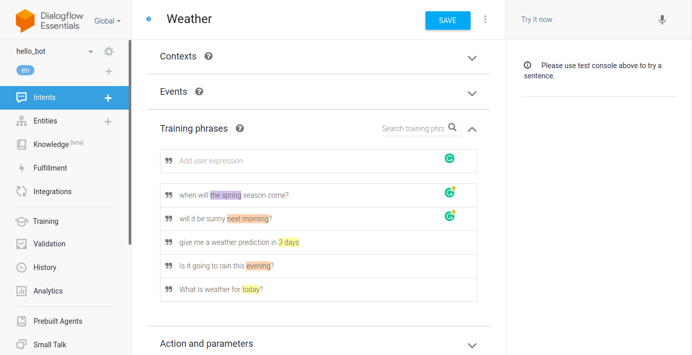

# Dialogflow Chatbot on Node.js

Steps to create a bot using dialogflow, consumed by Node.js server.

## Preparation Before Begin

1. <a href="https://console.cloud.google.com/cloud-resource-manager" target="_blank">Select or create a Cloud Platform project.</a>

2. <a href="https://console.cloud.google.com/" target="_blank">Go to google cloud console.</a>

3. <a href="https://cloud.google.com/billing/docs/how-to/modify-project?visit_id=637550185194399335-1300588891&rd=1#enable-billing" target="_blank">Set up the billing account.</a>

4. <a href="https://console.cloud.google.com/flows/enableapi?apiid=dialogflow.googleapis.com" target="_blank">Enable the Dialogflow API and its credentials.</a>

5. <a id="service-account" href="https://cloud.google.com/docs/authentication/getting-started" target="_blank">Enable Set up authentication with a service account.</a>


## Create Dialogflow Bot

1. Visit
   <a href="https://dialogflow.cloud.google.com/" target="_blank">
   https://dialogflow.cloud.google.com/
   </a>.


1. Create an agent and set the google project.


3. Create an intent.


4. Train agent using some expressions.



5. Give it default responses, then you can test it on right area.


## Project Setup

1. Rename `.example.env` file to `.env`.

2. Copy Project ID from dialogflow agent setting to `.env` file as PROJECT_ID.


3. set GOOGLE_APPLICATION_CREDENTIALS in `.env` file as directory to generated key you got from <a href="#service-account">this step</a>.

4. ```npm install```

## Running Project

```node index.js```